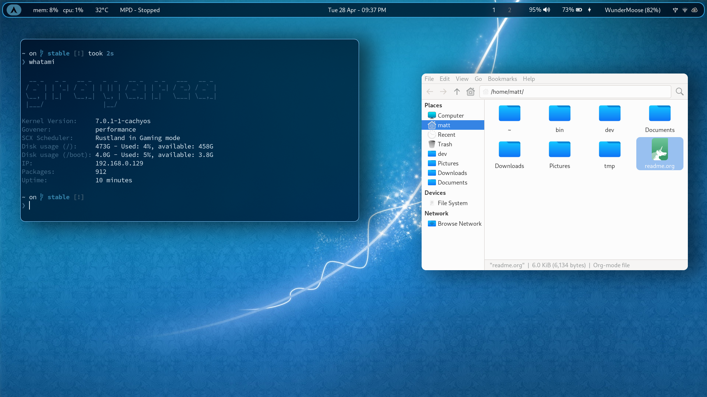

Some theming has been ruthlessly stolen from such great projects as:
 - [[https://github.com/JaKooLit/Hyprland-Dots][JaKoolLit]]
 - [[https://ml4w.com/][ML4W]]

Why?  Because fuck CSS, that's why.

* Installation
This setup is intended for an intel laptop using WiFi.

 - Install Cachy (mannually setting up BTRFS snapshot support is a pain, hence Cachy, but will still work 100% with vanilla Arch).  Make sure =NetworkManager= and =Pipewire= are installed.
 - Ensure all of your drivers are installed (Cachy installer should detect/install what you need, otherwise consult the Arch Wiki).  For an example of the kinds of drivers you need, look [[file:.config/bootstrap/bin/bootstrap-laptop.sh][here]].
 - Run =$HOME/bin/bootstrap=-hyprland.
 - Find out if your hardware is supported by [[https://wiki.archlinux.org/title/Fwupd][fwupd]] and update your firmware if so.
 - See if there's anything specific for your [[https://wiki.archlinux.org/title/Category:Laptops][laptop.]]
 - If using an intel GPU, add =i915_enable_rc6=1 i915_enable_fbc=1= to the kernel cmd line for extra power-saving.
 - Test if wifi Wake On Lan is enabled with =iw phy0 wowlan show= (use =iw list= to get name of adaptor).  Not sure how to disable it permanently, but it's disabled by default on my laptop so I stopped looking :-)
 - Optional if you a) want hibernate to work and b) have a sufficiently sized swap partition:
    Enable zswap as detailed [[https://wiki.cachyos.org/configuration/general_system_tweaks/#switching-from-zram-to-zswap][here]].  For vanilla Arch, check the [[https://wiki.archlinux.org/title/Zswap][Wiki]].

    May also need to add =module_blacklist=intel_hid= owing to a kernel bug if using an intel laptop.  WARNING: this will disable some multi-media keys, along with the power button (although long-press to power-off still works).

* Changing theme
Either use the script =$HOME/bin/paper [paper|theme|both] /path/to/image= or right-click and select =Theme= on an image in Thunar (this will call the same script).

=paper= will set the wallpaper, =theme= will set the theme (based off of the image's colors) and =both= will do both.

* Screenshots

The mandatory =fastfetch= shot:

* VM Notes
Add =intel_iommu=on= to kernel parameter.

To pin VM to given cores, use the following in the VM's XML:
#+begin_src xml
<vcpu placement="static">4</vcpu>
<cputune>
  <vcpupin vcpu="0" cpuset="2"/>
  <vcpupin vcpu="1" cpuset="6"/>
  <vcpupin vcpu="2" cpuset="3"/>
  <vcpupin vcpu="3" cpuset="7"/>
</cputune>
#+end_src

Can then add the following to =/etc/systemd/system.conf= so that the host OS doesn't use those cores.

=CPUAffinity=0,4,1,5=

Note that the odd-looking numbering is because Intel number their virtual core like so:

|---------------+----------+---------|
| Physical Core | V Core 1 | VCore 2 |
|---------------+----------+---------|
|             1 |        0 |       4 |
|             2 |        1 |       5 |
|             3 |        2 |       6 |
|             4 |        3 |       7 |
|---------------+----------+---------|

* AppArmor
Add =lsm=landlock,lockdown,yama,integrity,apparmor,bpf= to the kernel boot parameters.
Also add =audit=1= to enable auditing.

* Still left to do
  - [ ] Theme SwayNC.
  - [ ] Get udiskie to open folders in Thunar (may require un-fucking xdg-open?).
  - [ ] Nice to have
    - [ ] Add setupSwap/hibernate to bootstrap script (swapfile, look into partition later).
    - [ ] Closing the laptop lid should first sleep (done) and then hibernate (requires sawp file and kernel parameters etc.)
  - [ ] Add Gateway to whatami IP.
  - [ ] Update whatami to enumerate mounted block devices.
  - [ ] Fix emacs colors - nothing shows when using client in the terminal.
  - [ ] Improve Emacs sart-up speed.
  - [ ] Find out why  can never see cdn77.
  - [ ] Install =copyparty= onto pi.
  - [X] Look into meld - file/VC comparison.
  - [X] Fix Emacs config - org blocks and checkboxes.
  - [ ] Copy music onto phone if the combination of Windows 11 and Apple's garbage software doesn't give me fucking brain-damage.
  - [X] Add SwayNC.
  - [X] Find out why hypridle isn't honouring full-screen video.
  - [X] Thunar isn't remembering size or position.  Fix.  Check if it does in Niri.
  - [X] Setup Cider in Emacs.
  - [X] Add GTK/QT theming.
  - [X] Add UFW back to installer.
  - [X] Check out the wallust emacs theme [[https://codeberg.org/explosion-mental/wallust-templates/src/branch/master/doom-wallust-dark-theme.el][here.]]

* The "is it done" checklist of doom
  - [X] General:
    - [X] Desktop portal is running.
    - [X] Notifications are working.
    - [X] Clipboard helper.
    - [X] Screenshot tool.
    - [X] All of the fonts [[https://www.cogsci.ed.ac.uk/=richard/unicode-sample.html][here]] are readable.
  - [X] Can build emacs with =PGTK=, =NativeCompilation= and =TreeSitter.=
  - [X] Plugin another monitor (or two) and see if everything still works.
  - [-] Application support:
    * [X] Steam.
    * [ ] Zoom - web.
    * [ ] Zoom - native.
    * [X] Open/extract/create .zip, .rar, .7zip files from file-manager.
  - [X] Networking:
    * [X] Can browse SAMBA shares from file-manager.
    * [X] Can browse with AVAHI (i.e. ping hostname.local).
  - [X] Firefox:
    * [X] Firefox is using GPU for video rendering (intel-gpu-tools/intel_gpu_top).
  - [X] Security
    * [X] Passing score (70%) on lynis. (Screw it 68% is good enough.)
  - [-] Laptop:
    * [X] Wifi is working, can browse and connect
    * [-] Ditto for Bluetooth.
      * [ ] Can connet a mouse
      * [X] Can connect headphones
    * [X] Lid sleeps & locks.
    * [X] Can read from SD card.
  - [X] Theme
    - [X] Can right-click in file-manager and set theme.
  - [X] USB drives are auto-mounted.

Images in =$HOME/Pictures/Wallpapers= are copyright their respective owners, and were nabbed/copied from =https:/wallpaperaccess.com=.

--------------------------------------------------------------------------------

       This program is free software: you can redistribute it and/or
       modify it under the terms of the GNU General Public License as
       published by the Free Software Foundation, either version 3 of
       the License, or (at your option) any later version.

    This program is distributed in the hope that it will be useful,
    but WITHOUT ANY WARRANTY; without even the implied warranty of
    MERCHANTABILITY or FITNESS FOR A PARTICULAR PURPOSE. See the GNU
    General Public License for more details.

    You should have received a copy of the GNU General Public License
    along with this program. If not, see
    <https://www.gnu.org/licenses/>.
